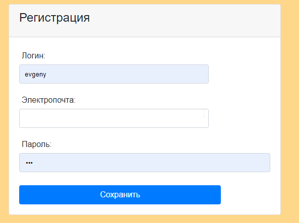
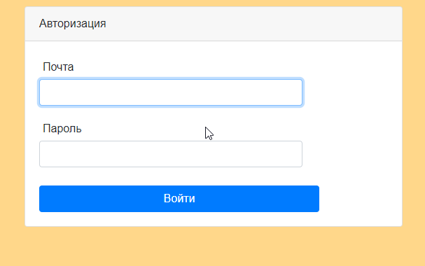
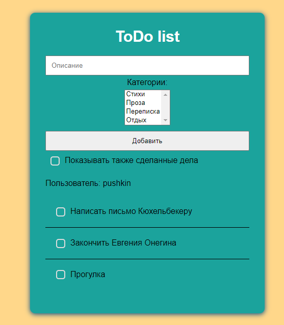
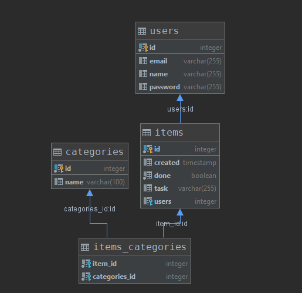

## job4j_todo list

### Описание
Классический список дел. Задачи храняться в базе данных. Есть авторизация. 
Заданиям можно присваивать категории.

### Технологии
- Java 12
- Java Servlets
- Apache Tomcat
- Hibernate
- PostgreSQL 10
- JS, AJAX 
- HTML, Bootstrap4
- Maven

### Функциональность
#### Регистрация.

#### Авторизация.

#### Список задач.

#### Схема базы данных

